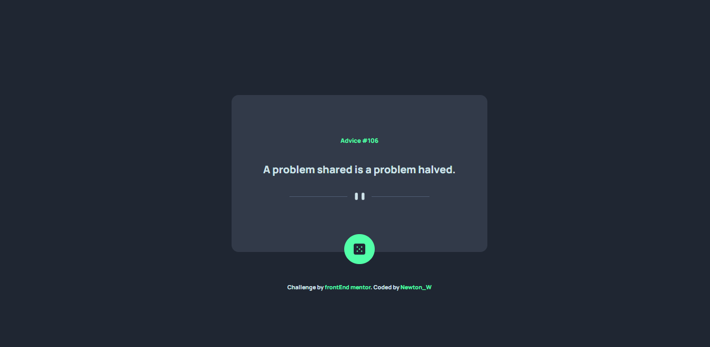

# Frontend Mentor - Advice generator app solution
Users should be able to:

- View the optimal layout for the app depending on their device's screen size
- See hover states for all interactive elements on the page
- Generate a new piece of advice by clicking the dice icon

### Screenshot

##Live Site

- Live Site URL [Advice-Generator](https://newt-advice-generator.netlify.app/)

## Author

- Frontend Mentor - [@newton-w](https://www.frontendmentor.io/profile/newton-w)
- Twitter - [@newton_warui](https://www.twitter.com/newton_warui)
